# Usage
{: .no_toc }

### Common Tasks
{: .no_toc .text-delta }

* TOC
{:toc}

 

## Creating the settings.json Config File

New in Mover 2.0+, you can now use the Mover_Admin.exe file to generate and validate the configuration settings used during the Mover migration process.

Opening **Mover_Admin.exe** presents you with a series of screens that walks you through providing the required information and at the end will validate the correct combinations of settings and if correct will generate a settings.json file.

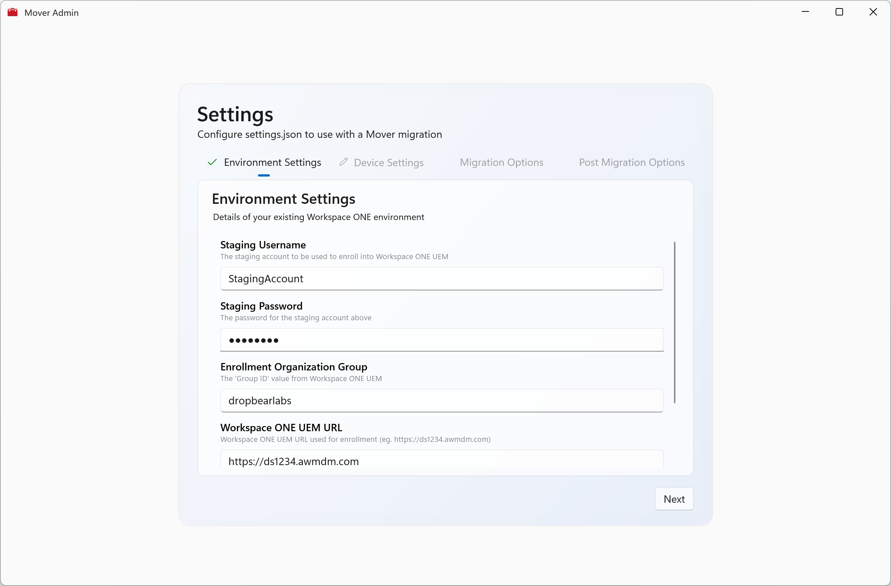

>### ⚠️ Important
>{: .no_toc }
> **Mover_Admin.exe** also accepts arguments when being started. 
> 
> You should **only** specify --initiate-migration as an argument when intending to start a real-world migration of the device
>
> **and**
> 
> You should **only** specify --revert as an argument when intending to revert any device migration configuration from a device.

 
### Environment Settings Options

This is the initial page where you specify the environment details of the **destination** Workspace ONE UEM Environment.

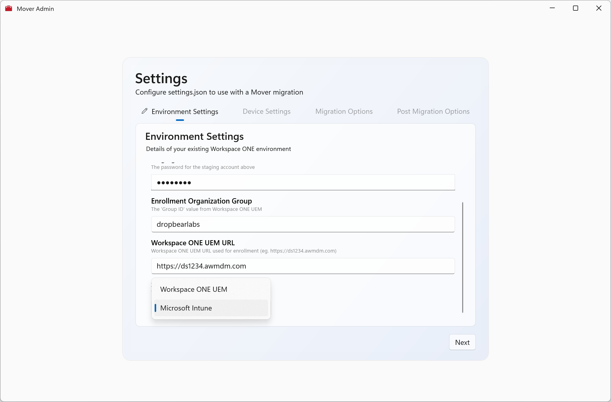

| Setting                           | Description                                                                                | Notes                                                                                                              |
|:----------------------------------|:-------------------------------------------------------------------------------------------|:-------------------------------------------------------------------------------------------------------------------|
| Staging Username                  | The user account *already created* in Workspace ONE UEM configured for Single User staging |                                                                                                                    |
| Staging Password                  | The password for the above account                                                         |                                                                                                                    |
| Enrollment Org Group              | The GroupID value of the Organization Group where the devices will enroll                  |                                                                                                                    |
| Workspace ONE Device Services URL | The "ds" URL of your UEM Environment    (eg. `https://ds1234.awmdm.com`)               | Ensure you use `dsXXXX` not _`cn`_ or _`as`_                                                                       |
| Source MDM                        | Which MDM the device is currently enrolled in                                              | This presents different configuration options and also will perform different actions on the device being migrated |

 
### Device Options

Here you configure how the device should be set up for the migration. Primarily this is for specifying the Administrator account to be created or used locally on the device.

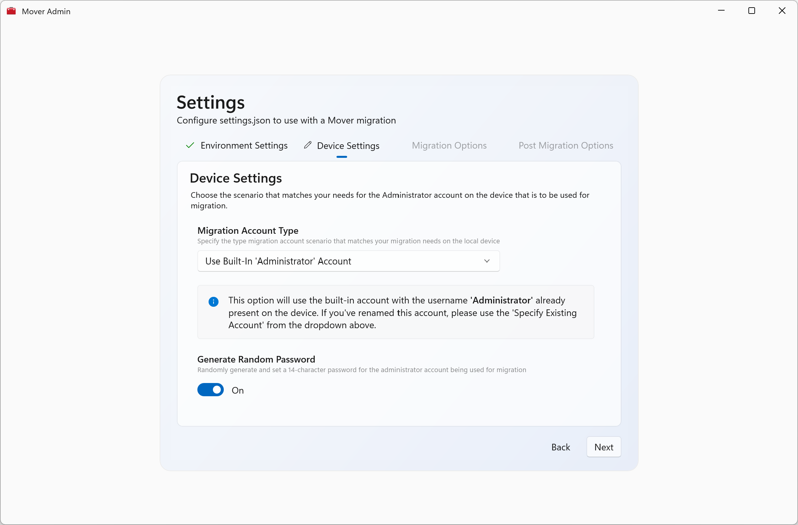

| Setting                | Description                               | Notes                                                                                                                                                                               |
|:-----------------------|:------------------------------------------|:------------------------------------------------------------------------------------------------------------------------------------------------------------------------------------|
| Migration Account Type | Create New Account                        | This option will create a *new* local account with Administrator privileges to perform the migration. By default, the username is "mover"                                           |
|                        | Use Built-In Administrator Account        | This option will use the Administrator account built into Windows and will enable it temporarily for migration.                                                                     |
|                        | Specify Administrator Account             | If you have *already* renamed the Administrator account on devices or if you have a different local Administrator account, select this option and specify the Username and Password |
| Generate Password      | Generate a password for the above account | If set to `true`, this will generate a random 15 character password and will set this on the created account or the built-in Administrator account                                  |

 
### Migration Options

Here you can set some more specific settings around actions the device should perform.

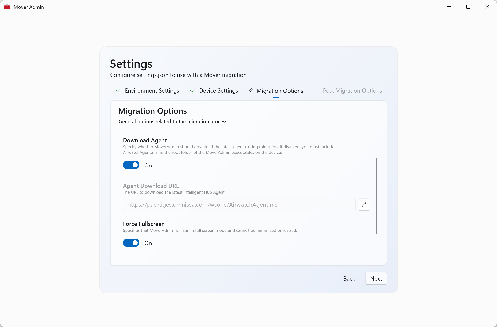

| Setting                | Description                                                             | Notes                                                                                                                                                  |
|:-----------------------|:------------------------------------------------------------------------|:-------------------------------------------------------------------------------------------------------------------------------------------------------|
| Download Agent         | Instructs Mover to download the latest agent                            | If set to `off`, you must also provide the `AirwatchAgent.msi` installer in the same folder as Mover.exe                                               |
| Force Fullscreen       | Instructs Mover to run in Fullscreen and cannot be minimized or resized |                                                                                                                                                        |
| Allow Exit             | Whether Mover is able to exited by using the Close button               | By default, `Allow Exit` is off. It enabled, it will allow anyone with access to the device to close the app.                                          |
| Enable Lockdown Mode   | Whether to apply device lockdown configuration while migration          | Strongly recommended to leave `On` as this removes the ability for users to access Task Manager and other settings from the CTRL+ALT+DEL menu          |
| Enable Minimal UI Mode | Use the default UI experience or a minimal Windows-like screen          | The default full UI shows status in realtime and displays that Mover is running. The minimal UI is similar to the "We're getting this ready..." screen |

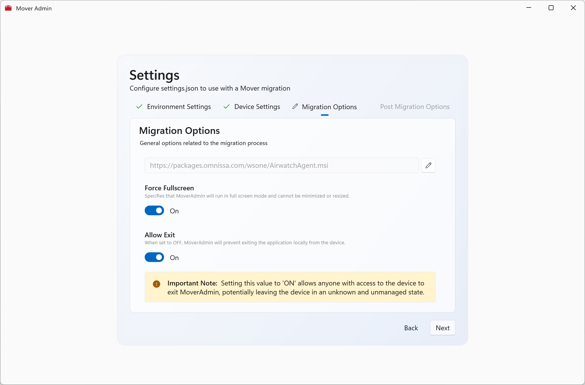

 
### Post Migration Options

Here you configure what to perform or wait for after a device has migrated or what to wait for to consider a device has migrated successfully

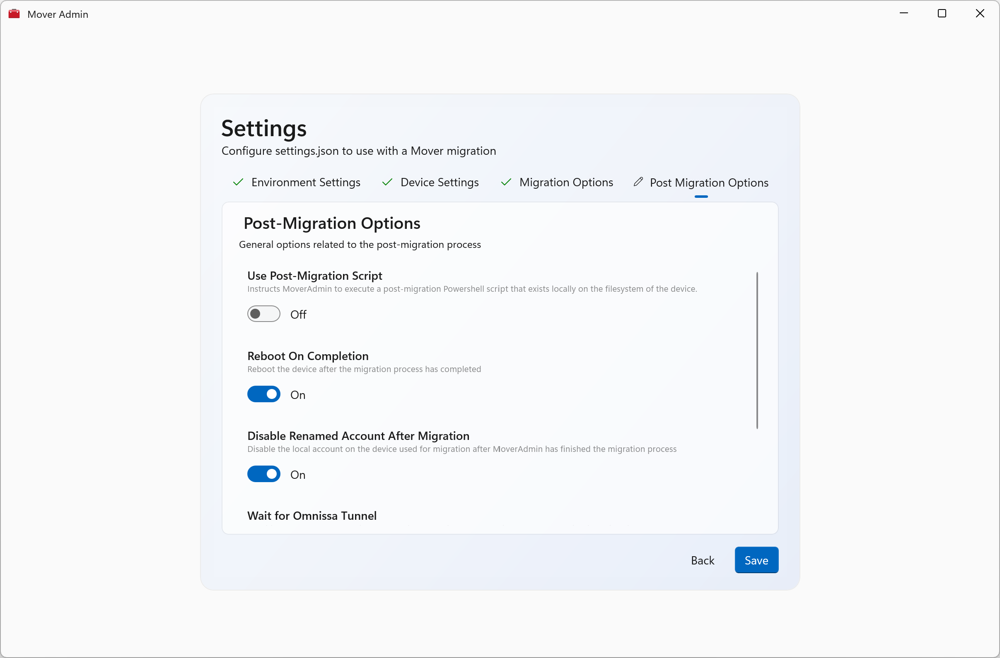

| Setting                                 | Description                                                                                     | Notes                                                                                                                                                |
|:----------------------------------------|:------------------------------------------------------------------------------------------------|:-----------------------------------------------------------------------------------------------------------------------------------------------------|
| Use Post-Migration Script               | Instructs Mover to run a specified Powershell script after migration                            | When set to `On`, the Administrator can specify the **filename** of the Powershell script that **already exists** in the folder where Mover resides. |
| Reboot On Completion                    | Automatically reboot the device after a successful migration                                    |                                                                                                                                                      |
| Disable Renamed Account After Migration | Disable the specified local Administrator account after migration                               | By default, this is set to `On` when *creating* an Administrator account.                                                                            |  
| Wait for Omnissa Tunnel                 | Wait for Omnissa Tunnel to install after enrollment before considering migration complete       | This must be set to `On` if specifying Wait For Offline Domain Join as `On`                                                                          |  
| Wait for Offline Domain Join            | Wait for Offline Domain Join configuration to be received before considering migration complete | If set to `On` you must also wait for Omnissa Tunnel                                                                                                 |  

 
## Validating Settings

Before saving the configuration from MoverAdmin to settings.json, validation occurs to ensure there are no conflicting settings.

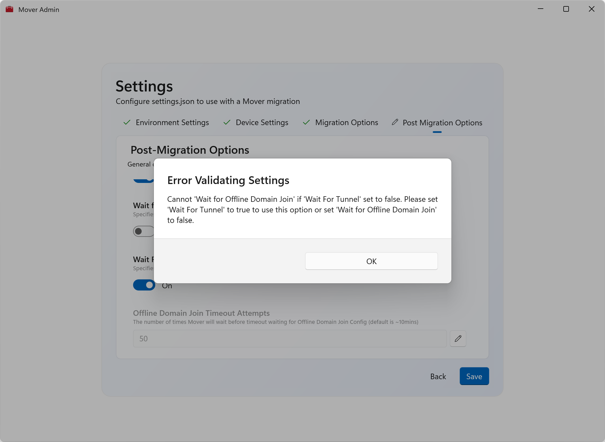

Similarly, if you open MoverAdmin and there's an existing settings.json file, it will be opened and validated. If any conflicting settings are found, (for example after changing a value in the file manually) an message will be displayed.

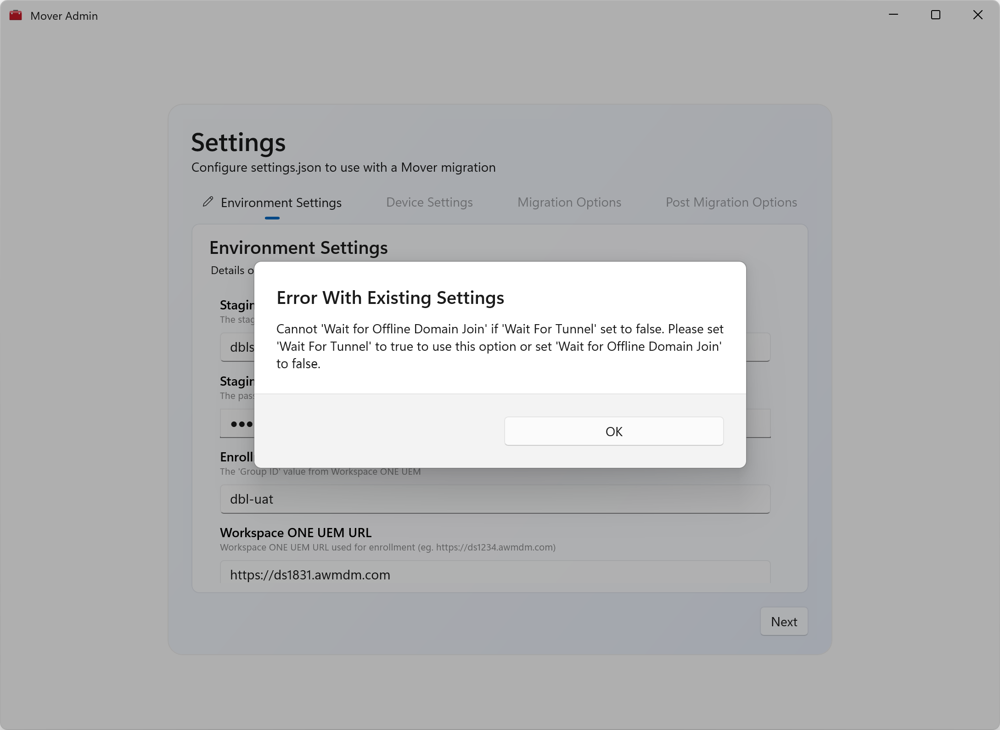

 
## Deployment

### Workspace ONE UEM

After configuring your settings.json file, you now need to deliver `Mover.exe`, `MoverAdmin.exe` and `settings.json` to the devices to be migrated. These files can be stored anywhere on the device, however it is recommended to store these somewhere that Standard Users cannot access for security purposes.

One option to deliver the files using Workspace ONE is to combine all the Mover files into a single .zip file.

You can then deploy this .zip file as a **Native Internal Application** in Workspace ONE UEM where the device is **currently** enrolled. After uploading the .zip file, use the following settings:

### 1.️ Set the Install Command to be `Mover.exe`
{: .no_toc }

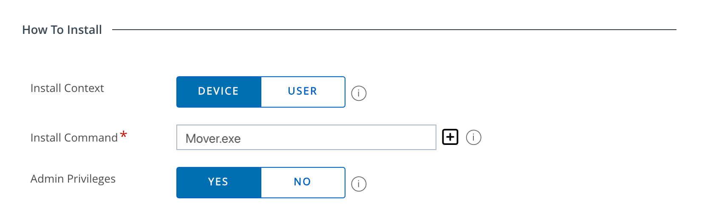

### 2. Set the Uninstall Command to be `rm -force C:\Recovery\OEM\Mover`
{: .no_toc }

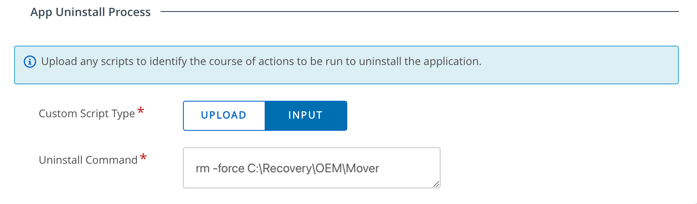

### 3. Set the Uninstall Command as `file exists = C:\Recovery\OEM\Mover\Mover.exe`
{: .no_toc }

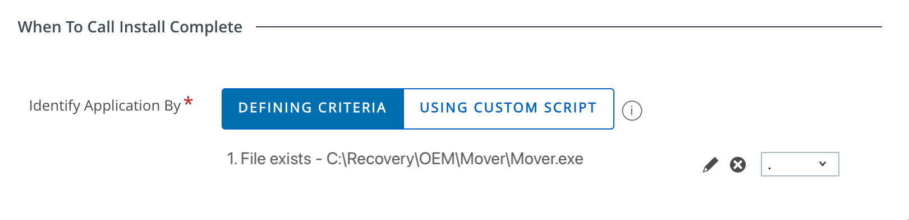

>### ⚠️ Important
>{: .no_toc }
> A change from version 1.x of Mover, this no longer immediately initiates a migration. When setting the install command to be Mover.exe without any parameters, Mover will gracefully exit indicating a successful install.

You should now set the Assignment Criteria and the Deployment to Automatic to ensure that the Mover migration files are staged ready for a migration at a later time.

### Intune

After configuring your settings.json file, you now need to deliver `Mover.exe`, `MoverAdmin.exe` and `settings.json` to the devices to be migrated. These files can be stored anywhere on the device, however it is recommended to store these somewhere that Standard Users cannot access for security purposes.

To proceed with preparing the migration from Intune, combine all the Mover files into a single directory.

If you do not have the **Intune Win32 Content Prep Tool** you can download it [here.](https://github.com/microsoft/Microsoft-Win32-Content-Prep-Tool) This is used for creating the .intunewin file for uploading to the Intune console.

>### ⚠️ Important
>{: .no_toc }
> When using the tool, the **source** directory is the whole Mover directory. The **install command** will be Mover.exe.

Now upload the .intunewin file to your Intune Management Console using the below settings:

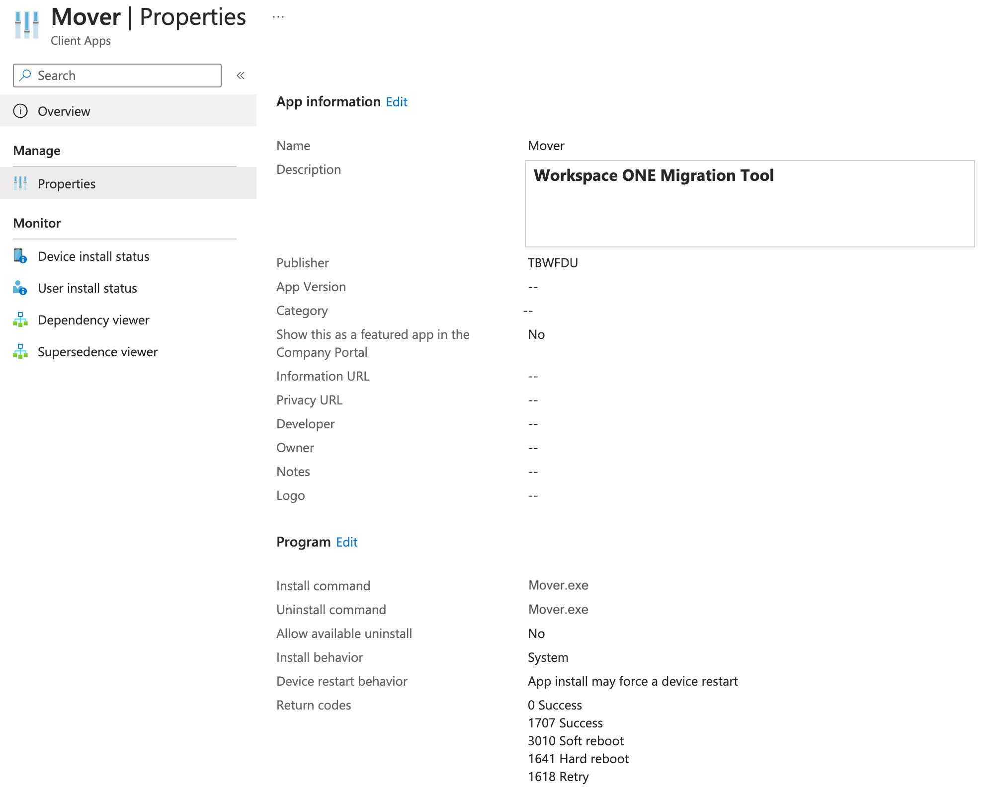

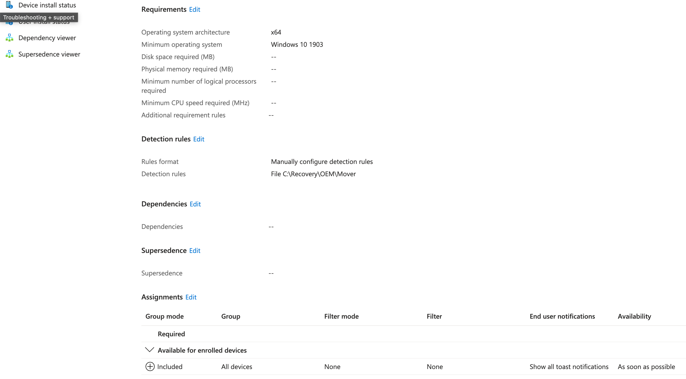

>### ⚠️ Important
>{: .no_toc }
> A change from version 1.x of Mover, this no longer immediately initiates a migration. When setting the install command to be Mover.exe without any parameters, Mover will gracefully exit indicating a successful install.

You should assign this application as **required**, to ensure that the Mover files are staged to the device to prepare for migration at a later time.

 
## Initiating a Migration

In order to initiate a migration on the device, the following command needs to be issued **to the device**:

`MoverAdmin.exe --initiate-migration`

### Workspace ONE UEM

Where Workspace ONE UEM is the Source MDM, you can issue this command as a **script** and optionally use this script inside a UEM Workflow. To ensure that the Workspace ONE UEM Managed device receives the command correctly, can you use the below Powershell code as the contents of the script:

>`Start-Process "C:\OEM\Recovery\Mover\MoverAdmin.exe" -ArgumentList @(
>    '--initiate-migration'
>)`

### ⚠️ Important
{: .no_toc }
Ensure you set the Execution Context to `System Context` 

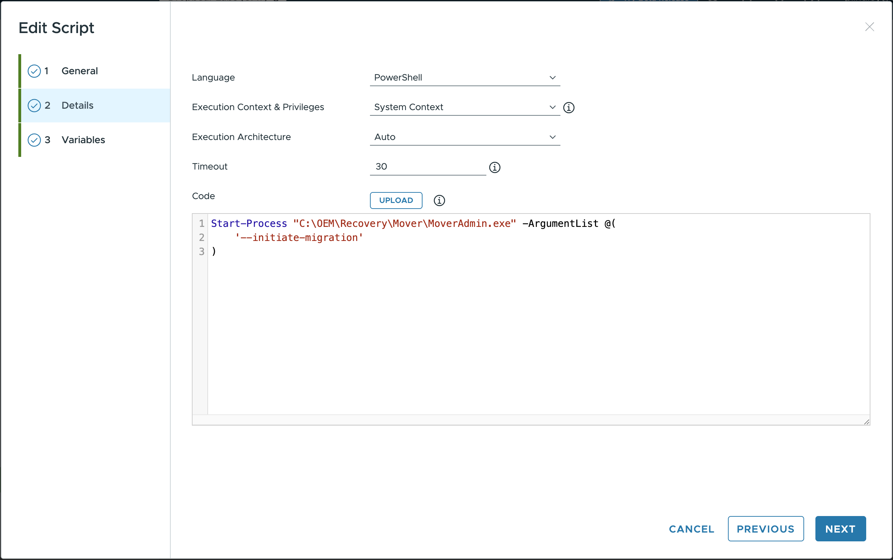
### ℹ️ Note
{: .no_toc }
Ensure you adjust the path in the command if you install Mover to a different location.

### Intune

When using Intune as the source MDM, the options to trigger the migration are a bit more limited. 

The script functionality within Intune does not allow for On-Demand triggering. Given this, you can still push the same script as above but it will process whenever the device receives the command. You can use the 'Platform Scripts' function and assign it to the devices you want to migrate. This will immediately start the migration.

### ⚠️ Important
{: .no_toc }
Ensure you set the Execution Context to `System Context`

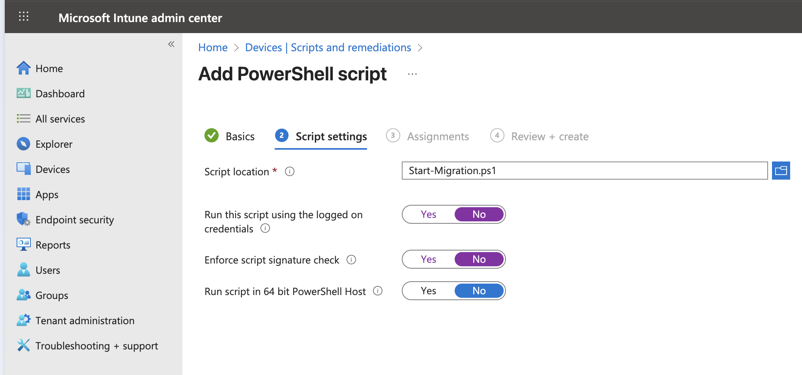

### ℹ️ Note
{: .no_toc }
Ensure you adjust the path in the command if you install Mover to a different location.

**The other option** for Intune would be to change the 'Install Command' in the Intune Deployment section **above** to be:

`MoverAdmin.exe --initiate-migration`

This will immediately trigger the migration process upon installation of the Mover.intunewin package.